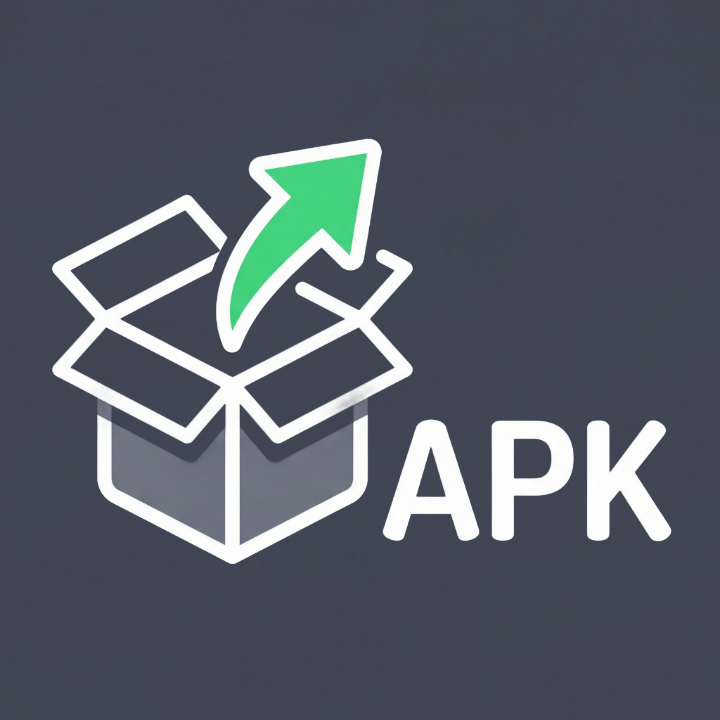
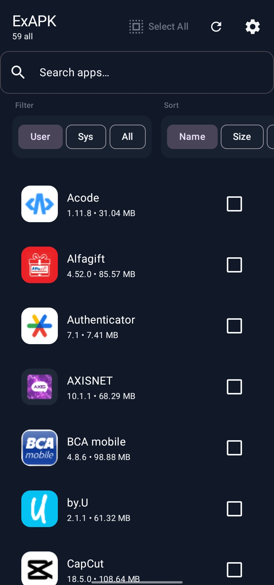
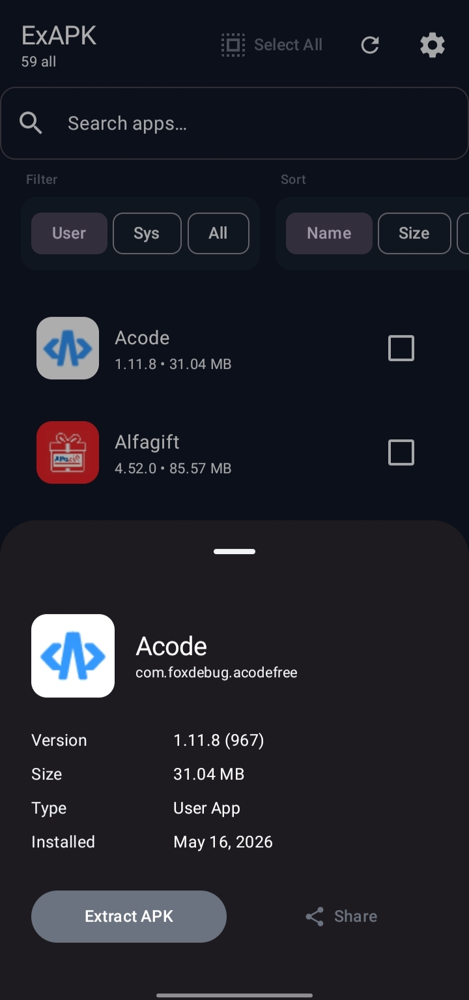
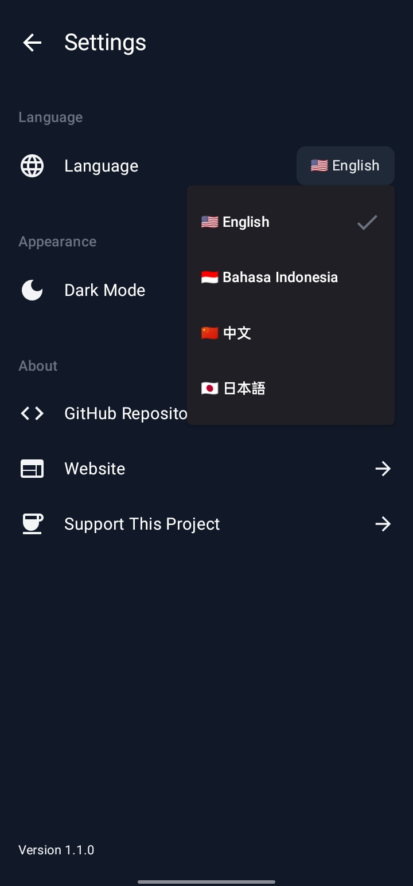
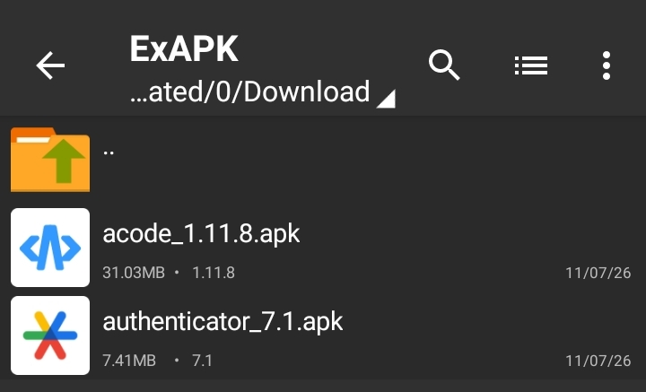

# ExAPK: APK 提取与备份工具

<p align="center">
  
</p>

<h1 align="center">ExAPK</h1>
<p align="center">
  <strong>Android APK 提取与备份实用工具</strong>
</p>

<p align="center">
  <a href="https://github.com/Curzyori/ex-apk"><strong>🌐 官方网站</strong></a>
</p>

<div align="center">

[](https://github.com/Curzyori/ex-apk/stargazers)
[](https://github.com/Curzyori/ex-apk/network/members)
[](LICENSE)
[](#)

</div>

<p align="center">
  <a href="#why-exapk">为什么做这个</a> ·
  <a href="#key-features">功能特性</a> ·
  <a href="#installation">安装指南</a> ·
  <a href="#quick-start">快速开始</a> ·
  <a href="#preview">预览</a> ·
  <a href="#support">支持</a>
</p>

<p align="center">🌐 支持 4+ 种语言 —
  <a href="README.md">🇺🇸 EN</a> ·
  <a href="README_ID.md">🇮🇩 ID</a> ·
  <a href="README_CN.md"><b>🇨🇳 CN</b></a> ·
  <a href="README_JP.md">🇯🇵 JP</a>
</p>

---

## <a id="why-exapk"></a>🕒 为什么做 ExAPK?

无需 root 权限，即可从 Android 设备提取任何已安装的 APK。非常适合在恢复出厂设置前备份、与他人分享应用、QA 测试，或建立个人应用存档。完全离线运行——无需联网。

|                              |                                                              |
| ----------------------------- | ------------------------------------------------------------ |
| ✅ **无需 Root**            | 使用标准 Android API 从任何已安装的应用提取 APK |
| ✅ **批量提取**            | 选择多个应用并一次性提取 |
| ✅ **离线优先**            | 零网络权限——完全离线运行 |
| ✅ **简洁的 Material 3 UI** | 快速、响应式的界面，可浏览 1000+ 应用 |
| ✅ **灵活输出**            | APK 文件保存至 /Download/ExAPK/ 便于访问 |

---

## <a id="key-features"></a>🎯 功能特性

| 功能 | 状态 | 描述 |
| :--- | :---: | :--- |
| **应用列表** | ✅ | 浏览所有已安装应用（用户 + 系统） |
| **搜索** | ✅ | 按应用名称实时搜索 |
| **筛选** | ✅ | 按 全部 / 用户应用 / 系统应用 筛选 |
| **排序** | ✅ | 按 名称 / 大小 / 安装日期 排序 |
| **批量提取** | ✅ | 选择多个应用并一次性提取 |
| **进度追踪** | ✅ | 查看批量操作的提取进度 |
| **分享 APK** | ✅ | 通过系统 intent 分享提取的 APK |
| **设置** | ✅ | 深色/浅色/自动主题 + 语言（EN/ID/CN/JP） |
| **离线** | ✅ | 无需网络权限 |

---

## <a id="installation"></a>📦 安装指南

1. **下载 APK**
   - 从 [GitHub Releases](https://github.com/Curzyori/ex-apk/releases) 获取最新 APK
   - 或访问网站：https://ex-apk.curzy.dev/

2. **在 Android 上安装**
   - 在设备设置中启用"允许安装未知来源应用"
   - 点击 APK 文件进行安装

3. **授予权限**
   - 当提示时，授予 **存储/文件** 权限
   - 这是读取已安装应用和写入 APK 文件所必需的

4. **开始使用**
   - 打开 ExAPK 并浏览已安装应用
   - 点击任意应用查看详情并提取其 APK
   - 或选择多个应用并使用"Extract"悬浮按钮

---

## <a id="quick-start"></a>🚀 快速开始

```bash
# 无需构建 —— 使用预构建的 APK
# 下载地址：https://github.com/Curzyori/ex-apk/releases

# 安装后：
# 1. 打开 ExAPK 应用
# 2. 浏览已安装应用
# 3. 点击任意应用 → "Extract APK"
# 4. APK 保存至 /Download/ExAPK/
```

---

## <a id="preview"></a>🖼️ 预览

<p align="center">
  
</p>

<p align="center">
  
</p>

<p align="center">
  
</p>

<p align="center">
  
</p>

---

## <a id="support"></a>☕ 支持

支持这个项目，请我喝杯咖啡！💝

<a href="https://donate.curzy.dev/">
  
</a>

---

## 📄 许可证

本项目基于 **Apache License 2.0** 发布 — 详见 [LICENSE](LICENSE) 文件。

<sub>作为 50 Projects Challenge 的第 19 个项目，由 **@Curzyori** 用心打造</sub>
